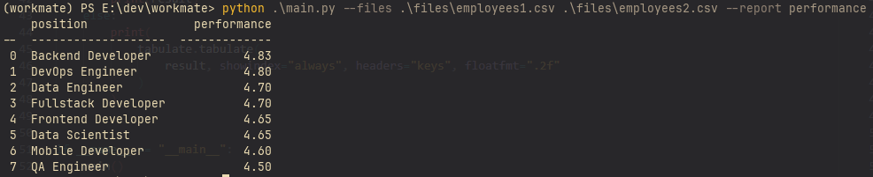
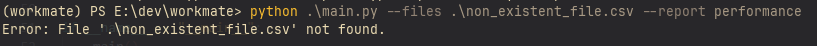
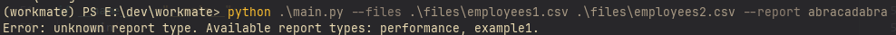

# Тестовое задание workmate

https://docs.google.com/document/d/1QwinJt_NBghu9O3qBQ7CvvjW7RykHizJjmrZuRwa37M/edit?tab=t.0#heading=h.x5nw4xn7dv3w

# Как запустить?
```
uv run

.\.venv\Scripts\activate

python .\main.py --files .\files\employees1.csv .\files\employees2.csv --report performance

pytest --cov=src .\tests\

pytest .\tests\
```

# Как добавить новый отчет?
В main.py есть ```handlers = { ... }```. Для создания нового типа отчета нужно добавить в ```handlers``` имя нового типа отчета и функцию, которая будет выполнять формирование отчета. Может потребоваться изменить код вывода отчета в консоль, так как сейчас им ожидается ```list[dict[str, Any]]```.

# Результаты запуска
## Пример успешного запуска

## Пример запуска с указанием несуществующего файла

## Пример запуска с указанием неизвестного типа отчета

